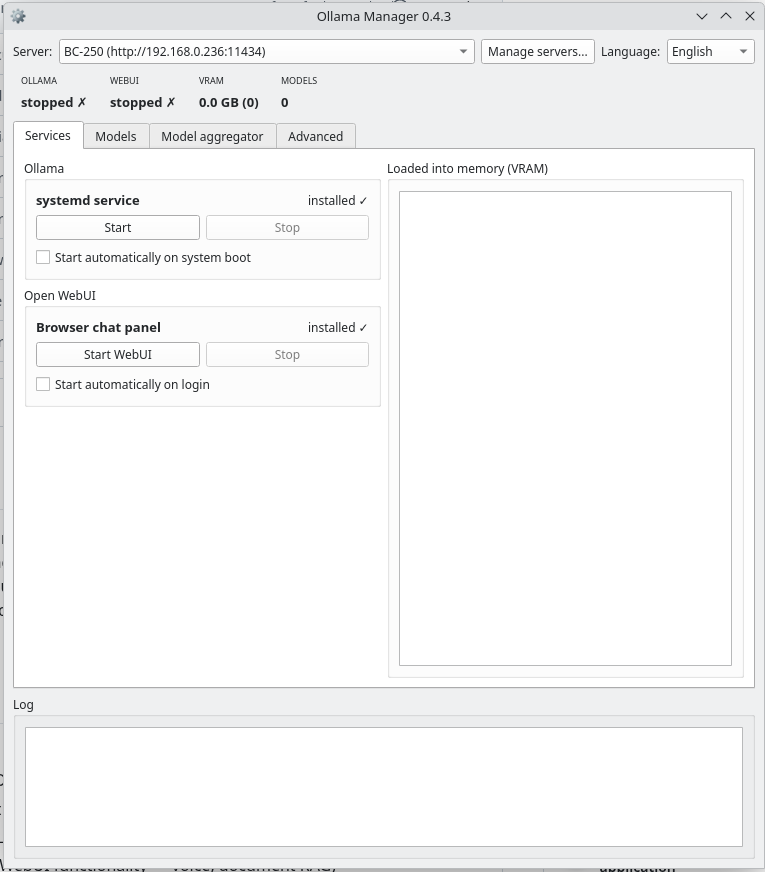

# Ollama Manager

Aplikacja desktopowa (PyQt6) pod KDE, która zaczynała jako prosty manager usługi
[Ollamy](https://ollama.com), a wyrosła w panel sterowania całym lokalnym stackiem AI:
zarządzanie modelami na wielu hostach naraz, agregator modeli (LiteLLM) wystawiający
jeden endpoint zgodny z API OpenAI dla narzędzi typu Continue/VS Code, oraz panel czatu
w przeglądarce (Open WebUI). Bez terminala, bez Dockera, bez chmury — wszystko działa
lokalnie, w Twoim LAN.

> **Status: działa, ale to wciąż wersja beta.** Aktywnie rozwijana — na bieżąco sprawdzam
> poprawność działania i regularnie dodaję nowe opcje i funkcjonalności. Możliwe drobne
> niedociągnięcia; [zgłoszenia błędów i uwagi](../../issues) są mile widziane.



## Wymagania

- Python 3 + **PyQt6**, **requests**
- **systemd** + **polkit** (`pkexec`) — standard na KDE/Debian; `install.sh` proponuje instalację
  `pkexec` przez `apt`, jeśli go brakuje (potrzebne do każdej akcji wymagającej uprawnień admina)
- **curl** — używany przez własne przyciski instalacyjne appki (Ollama, oraz uv dla Open WebUI/LiteLLM);
  `install.sh` proponuje jego instalację przez `apt`, jeśli go brakuje
- Ollama (jeśli jej nie masz, aplikacja sama ją zainstaluje jednym przyciskiem)
- Opcjonalnie: **uv** (do instalacji Open WebUI i LiteLLM — aplikacja doinstaluje je sama w razie potrzeby)
- Opcjonalnie: `ffmpeg`, `pandoc`, `zstd` (pełna funkcjonalność Open WebUI — głos, dokumenty w RAG)

## Instalacja i uruchomienie

Najpierw sklonuj repozytorium i wejdź do jego katalogu — poniższe skrypty
instalacyjne trzeba uruchamiać stamtąd (szukają `ollama_manager.py` obok siebie):

```
git clone https://github.com/cyryllo/Ollama-manager.git
cd Ollama-manager
```

**Jako aplikacja z menu, bez roota (zalecane)** — instaluje zależności przez pip,
kopiuje apkę do `~/.local/share/ollama-manager` i dodaje wpis w menu (sekcja
Narzędzia). Wykrywa istniejącą instalację i proponuje aktualizację/reinstalację:

```
./install.sh
```

Odinstalowanie: `./install.sh --uninstall` (komunikaty skryptu są po angielsku).

**Jako pakiet `.deb` (Debian/Ubuntu)** — zależności z `apt`, łatwe odinstalowanie:

```
./build-deb.sh
sudo apt install ./ollama-manager_*_all.deb
```

**Ręcznie, do dewelopowania** — bez kopiowania i wpisu w menu:

```
pip install PyQt6 requests
python3 ollama_manager.py
```

## Funkcje

**Usługa Ollama**
- Start / stop usługi systemd, wykrywanie stanu na bieżąco
- Autostart przy starcie systemu
- Wykrywanie braku instalacji + przycisk instalującej ją jednym kliknięciem

**Modele**
- Tabela zainstalowanych modeli — nazwa, rozmiar na dysku i kolumna z szacowanym/realnym
  VRAM dla każdego — + usuwanie
- Pobieranie nowych modeli z podpowiedziami popularnych (Llama, Gemma, Mistral, Phi, DeepSeek,
  Qwen, GPT-OSS, Ornith...) i paskiem postępu
- Wybór rozmiaru i kwantyzacji (domyślna/Q8_0/pełna F16) przy pobieraniu — obie listy są
  dopasowane do wybranego modelu (a kwantyzacja dodatkowo do rozmiaru), zweryfikowane na
  ollama.com/library; dla modeli wymagających dodatkowego segmentu w tagu przy niedomyślnej
  kwantyzacji (np. "instruct"/"it") appka dokleja go sama — Q8_0/F16 w ogóle się pokazują
  tylko tam, gdzie potwierdzono, że działający tag istnieje
- Bieżące, orientacyjne wyliczenie zużycia pamięci (wagi + KV cache + bufory, plus zalecany RAM)
  przy wyborze rozmiaru/kwantyzacji
- Podgląd modeli aktualnie załadowanych do pamięci (VRAM)

**Open WebUI**
- Instalacja panelu czatu w przeglądarce jednym przyciskiem (bez Dockera)
- Start / stop, autostart po zalogowaniu
- Przycisk "Otwórz WebUI" otwiera panel w przeglądarce (bez automatycznego otwierania)

**Przełącznik serwera**
- Wybór hosta Ollama (localhost albo dowolny w LAN, np. BC-250) dla operacji na modelach
- Dodawanie/usuwanie serwerów z poziomu okna, zapamiętywane między uruchomieniami

**Agregator modeli (LiteLLM)**
- Instalacja, start/stop i autostart LiteLLM jednym przyciskiem (bez Dockera)
- Wystawia jeden endpoint (zgodny z API OpenAI) łączący modele ze WSZYSTKICH
  serwerów z listy przełącznika — VS Code/Continue wskazuje tylko na ten adres
- Podgląd, jakie modele i hosty trafią do configu, przed uruchomieniem
- Generuje gotowy do wklejenia `config.yaml` dla Continue.dev na podstawie wystawionych modeli —
  appka nigdy sama nie zapisuje tego pliku, tylko podgląd/kopiowanie

**Zaawansowane (zmienne środowiskowe Ollamy)**
- `OLLAMA_KEEP_ALIVE`, `OLLAMA_CONTEXT_LENGTH` (domyślne 4096 za mało do pracy agentowej),
  `OLLAMA_MAX_LOADED_MODELS`, `OLLAMA_NUM_PARALLEL`, `OLLAMA_FLASH_ATTENTION`, `OLLAMA_KV_CACHE_TYPE`,
  `OLLAMA_VULKAN` (backend Vulkan zamiast ROCm, przydatne na kartach AMD bez pełnego wsparcia ROCm
  np. BC-250), `OLLAMA_IGPU_ENABLE`, `OLLAMA_HOST` (nasłuch w sieci LAN zamiast tylko lokalnie),
  `GGML_VK_VISIBLE_DEVICES` (indeks urządzenia Vulkan — niezbędne na niektórych APU), `OLLAMA_GPU_OVERHEAD`
  (ile VRAM zarezerwować dla reszty systemu — wybór z gotowych profili pulpit/serwer)
- Jeden przycisk "Zapisz" stosuje wszystkie pola naraz i restartuje usługę tylko raz, plus
  przycisk "Zastosuj zalecane wartości", który wypełnia formularz sensownym profilem startowym
  do przejrzenia przed zapisem
- Wolne pole na dowolną inną zmienną środowiskową, spoza gotowego formularza
- Pełne opisy każdej zmiennej są w osobnej zakładce "Pomoc" — ta zakładka zostaje kompaktowa

**Pasek statystyk**
- Status Ollamy i Open WebUI
- Zużycie VRAM na aktualnie wybranym serwerze
- Liczba zainstalowanych modeli

**Dziennik zdarzeń** — log wszystkich operacji, zawsze widoczny na dole okna.

**Język interfejsu** — polski, angielski, niemiecki, hiszpański, francuski, portugalski i włoski, przełączany z poziomu okna, zapamiętywany między uruchomieniami.

## Uwagi

- Sterowanie usługą Ollama zawsze dotyczy lokalnej maszyny — nawet jeśli w oknie
  wybrany jest zdalny serwer (np. BC-250), start/stop/autostart działają lokalnie.
